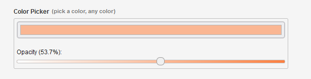
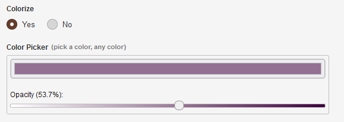

# [HTML5 Color Picker Add-On](https://github.com/trendoman/Addons)



This color picker uses the HTML5 input type="color" to select colors in the admin panel. We're all using modern browsers now, so there is no longer any need for a JS utility unless you want to get fancy. Because it uses the native HTML5 input type, the look and function of the field will vary between browsers and platforms.

Simply add an editable field of type 'color' to allow editors to select a color using their native tools.

```xml
<cms:editable type='color' name='my_color' label='Color Picker' desc='pick a color, any color' />
```

You may add four optional parameters to the tag:

## Parameters

### color

This will be the initial value of the field before it is saved. The default is white (#ffffff).

### field_width
### field_height

The width and height of the input field within the admin panel. Requires valid CSS width and height values. The default width is 100%. The default height is empty.

### alpha

Allow the user to add opacity to the color with the parameter _alpha='1'_. This will add an HTML5 slider to the admin field for setting the color's alpha value. The color is saved as an 8-digit hexadecimal color. The additional two digits are the alpha value. This is a relatively new standard, but it's widely adopted except for the now retired Internet Explorer. If your site needs to support IE, don't use this alpha feature.

```xml
<cms:editable type='color'
   name='my_color'
   label='Color Picker'
   desc='pick a color, any color'
   color='#d4fdd5'
   alpha='1'
   width='50%'
   height='100px'
/>
```

### validator_msg

Default error message is 'Wrong value'. This parameter allows to set up a custom error message.

## Reset value

As specifications do not allow empty values for inputs of type 'color' we'll resort to Couch's conditional-field feature to control appearance of the picker.



Add a check to the outputting code —

```xml
<cms:if has_color1><cms:show my_color1 /></cms:if>
```

— and modify original editable definition adding there a new controlling radio-box

```xml
<cms:editable type='radio' name='has_color1' label='Colorize' opt_values='Yes=1|No=0' opt_selected='0' order='10'/>

<cms:func _into='mycond' has_color1=''><cms:if has_color1 eq '1'>show<cms:else/>hide</cms:if></cms:func>

<cms:editable type='color'
   name='my_color1'
   label='Color Picker'
   desc='pick a color, any color'
   color='#d4fdd5'
   alpha='1'
   width='50%'
   height='100px'
   not_active=mycond
   order='20'
/>
```

Conditioning feature is available out of the box in modern Couch, so the code above works immediately.

## Installing the Add-On

View **[INSTALL](/INSTALL.md)** file for info.

Register the add-on by adding a line of code to `couch/addons/kfunctions.php`.

```php
require_once( K_COUCH_DIR.'addons/color-picker/color-picker.php' );
```

## Related pages

* **[https://github.com/fallingsprings/couch-add-ons/color-picker](https://github.com/fallingsprings/couch-add-ons/tree/master/color-picker)** - source
* **[https://www.couchcms.com/forum/viewtopic.php?f=8&t=12893](https://www.couchcms.com/forum/viewtopic.php?f=8&t=12893)** - forum discussion
* **[/jscolor](/jscolor)** — another color picker via JS library
